# FANTASIAN Neo Dimension Localization Workflow

[简体中文](https://github.com/Kanadeforever/FantasianND_TrWorkflow) | ENGLISH

This project outlines the localization translation workflow for "FANTASIAN Neo Dimension".
For friends who enjoy this game but struggle with importing and exporting text for translation, here's a reference solution.
Meanwhile, this project will also release the Chinese localization patch on the Release page after its completion, serving as the official download source for the Chinese patch.

---

## Preparing Tools

 - [Fantasian Neo Dimension](https://store.steampowered.com/app/2844850): Game main file;
 - [UABEAvalonia](https://github.com/nesrak1/UABEA): Unpacking & repacking tool;
 - [Ultimate ASI Loader](https://github.com/ThirteenAG/Ultimate-ASI-Loader): File isolation tool (optional but recommended).

---

## Workflow

For details, refer to [Workflow](tutorial/Workflow_EN.md).

---

## Credits

This project utilizes several open-source projects as carriers for loading localization files. We extend our deepest gratitude to the following projects:

- [UABEAvalonia](https://github.com/nesrak1/UABEA): Used for importing & exporting game texts. Without this project, our project wouldn't exist;
- [Ultimate ASI Loader](https://github.com/ThirteenAG/Ultimate-ASI-Loader): To isolate the game's localization files from the main game files, avoiding the need to reinstall the game due to official updates;
- [Microsoft Copilot](https://copilot.microsoft.com): A tool for text conversion, with debugging and refinement capabilities during later stages of tool development;
- [Chill Yunmo Gothic (Font)](https://github.com/Warren2060/ChillYunmoGothic): Used to replace font display in the game (for Simplified Chinese).
- [Jiangcheng Rhythm Gothic (Font)](https://weibo.com/1960937691/JoEPQ01Wq): Used to replace font display in the game (for Simplified Chinese).
- [Lxgw WenKai GB (Font)](https://github.com/lxgw/LxgwWenkaiGB): Used to replace font display in the game (for Simplified Chinese).

---

## Picture

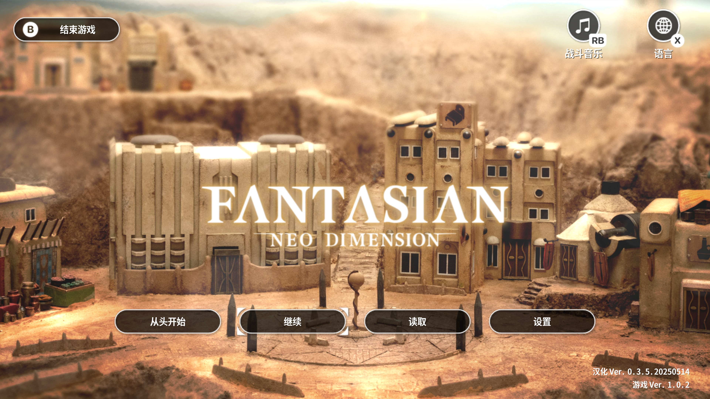

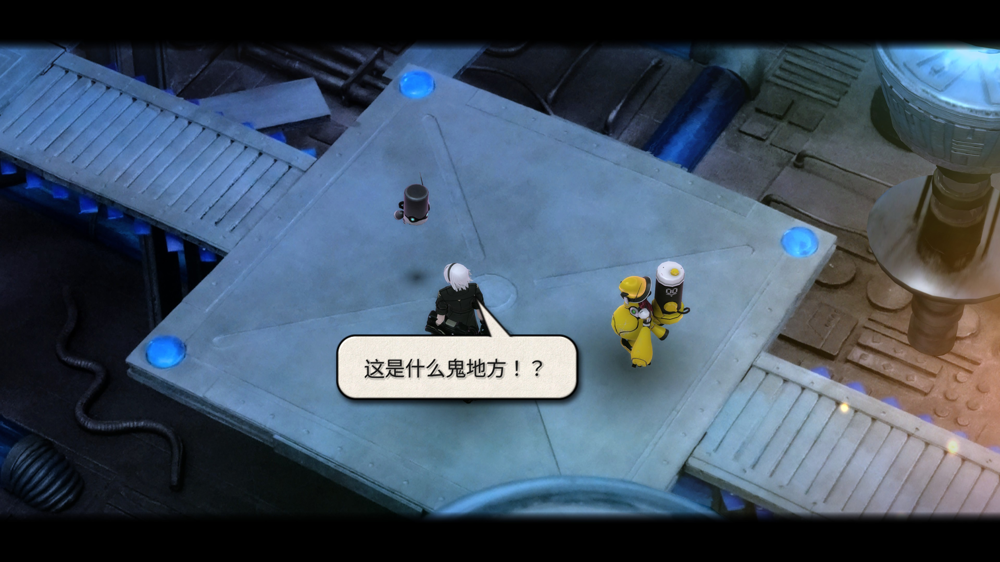

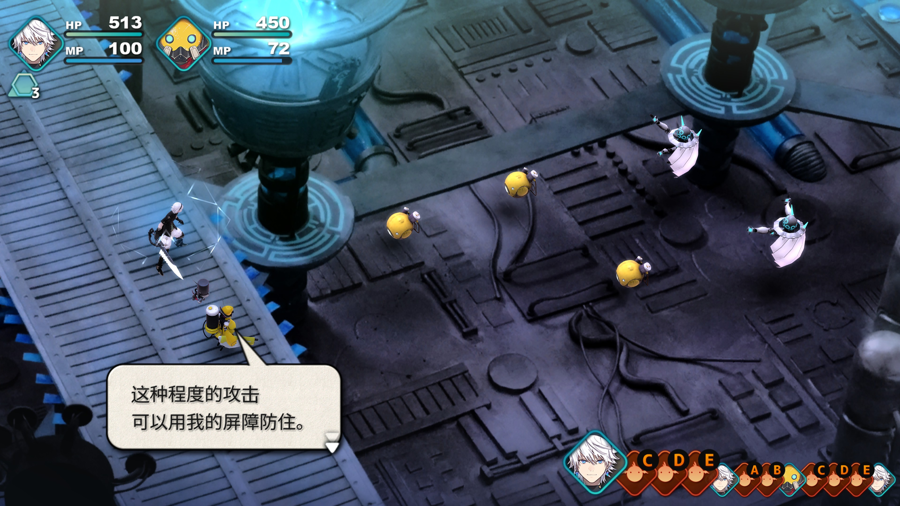

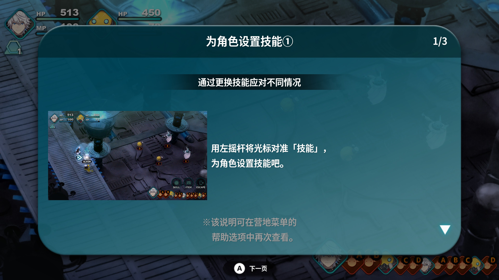

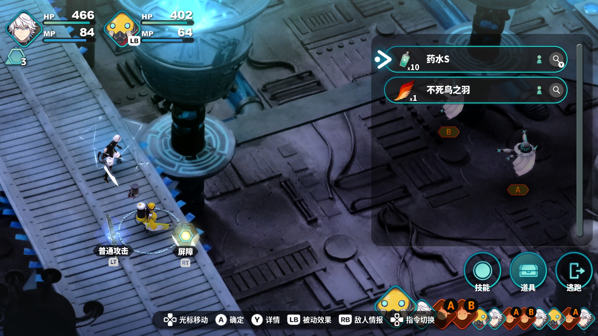

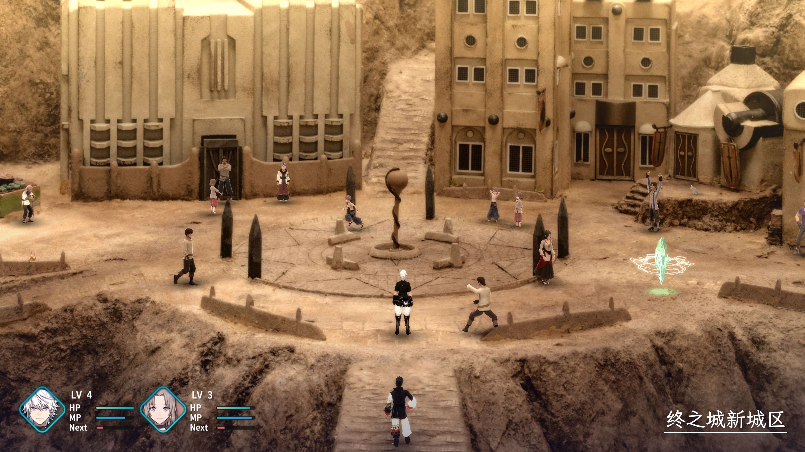

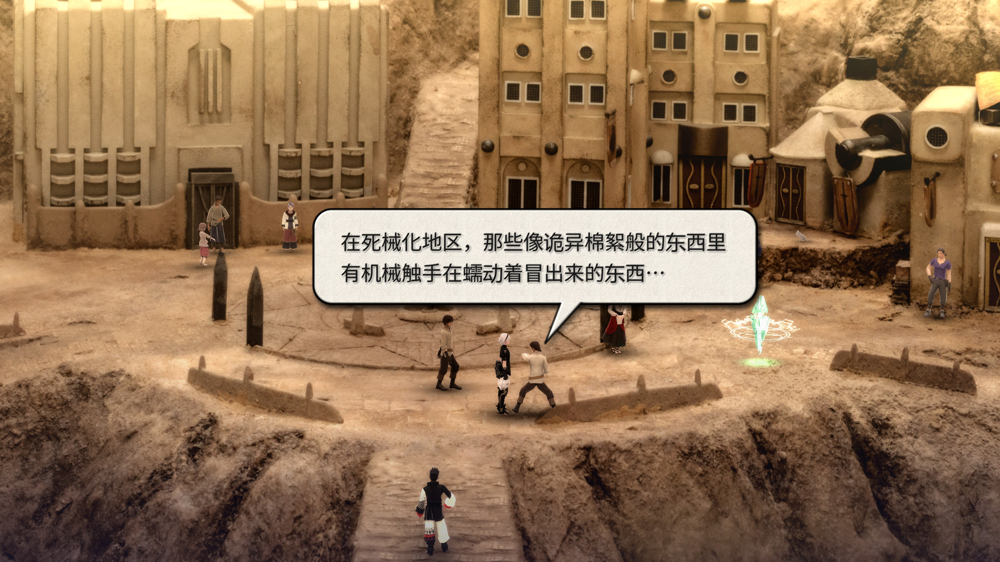

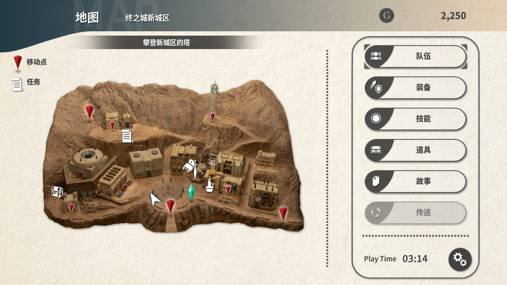

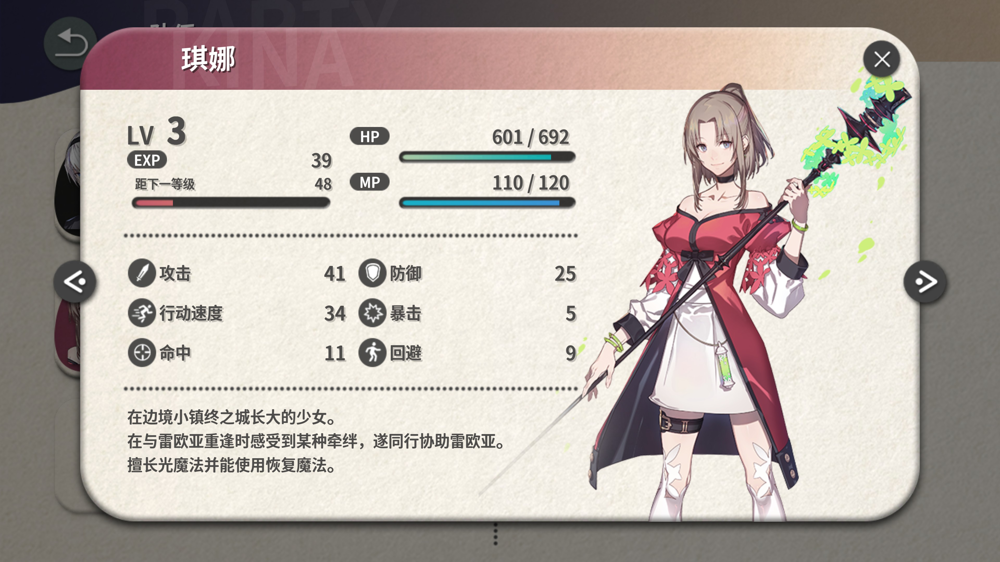

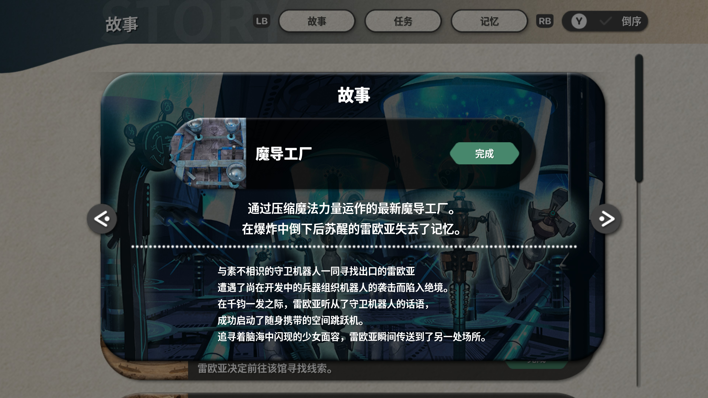

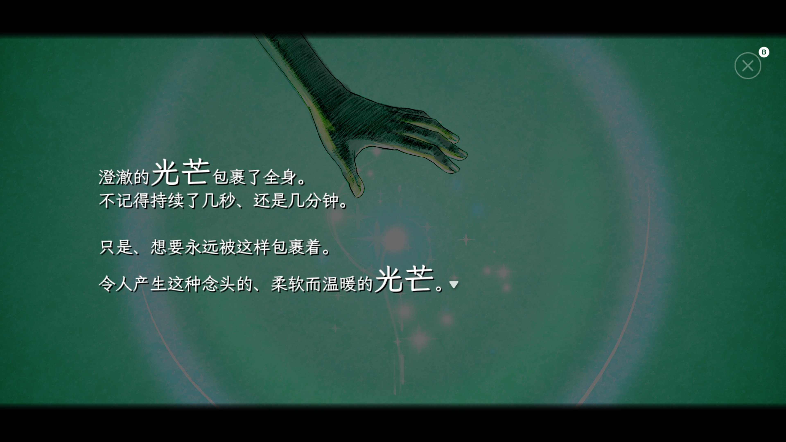
