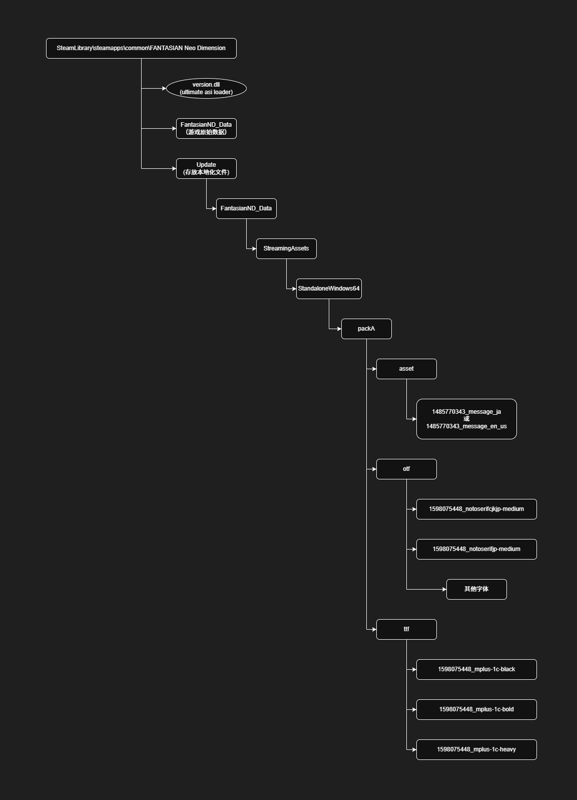

# 0. 在做之前

**本方法有一些注意事项：**
- 翻译的语言无法和替换这个语言的原始语言共存；
- 由于没有进行通关测试，可能会出现一些BUG；
- 暂时还不能修改图片，但因为游戏中没有什么特别需要修改的图片，所以本条影响不大；
- 本方法的主要用途为 `日语 → 简体中文` 的本地化作业，存在一些内容可能不适用于拉丁语系的本地化工作，这部分需要自行测试。
  - 比如字体的修改，可能日语调用的字体文件和英语不同。

确认无误后，进行下一步。

---

# 1. 定位文件

准备工作（参见readme部分）做完后，首先，要把待处理的文件，复制到单独的工作目录中，方便后续的操作。

**目录：**

> **游戏文本文件所在目录**
> 
>  ` "游戏根目录 \FantasianND_Data\StreamingAssets\StandaloneWindows64\packA\asset" ` 

参考图片：

 

> **游戏字体文件所在目录**
> 
> ` "游戏根目录 \FantasianND_Data\StreamingAssets\StandaloneWindows64\packA\otf" `
> 
> ` "游戏根目录 \FantasianND_Data\StreamingAssets\StandaloneWindows64\packA\ttf" `

参考图片：

 

 

**文件：**

> **语言文件**
> 一共有两个文件，二选一；分别对应游戏里语言切换的两个选项。
> - `1485770343_message_ja`
>   - ↑ 储存日语文本的文件，适合非拉丁语系的语言替换使用；
> - `1485770343_message_en_us`
>   - ↑ 储存英语文本的文件，适合拉丁语系的语言替换使用。
> ---
> **字体文件**
> - **otf** 文件夹
>   - `1598075448_notosanscjkjp-regular`
>     - 这个文件暂时没能测试出用途（但推断可能负责控制对话的字体），在这个项目中暂时不包含，仅列出以供参考。
>   - `1598075448_notoserifcjkjp-medium`
>     - 控制 "画面右下角场景名称"
>   - `1598075448_notoserifjp-medium`
>     - 控制 "记忆"
> 
> - **ttf** 文件夹
>   - `1598075448_mplus-1c-black`
>     - 控制 "菜单左上角"、"游戏时间"
>   - `1598075448_mplus-1c-bold`
>     - 控制 "主菜单选项文字"、"部分UI的标题"、"主菜单左上角说明"、"部分外层菜单的角色名字"
>   - `1598075448_mplus-1c-heavy`
>     - 控制 "菜单内文字"、"UI选项文字（不含主菜单选项）"、"部分内层菜单的角色名字"
>   - `1598075448_notosansjp-regular`
>     - 控制 "对话气泡字体"（其他未定位，游戏默认使用思源黑体）

确认以上无误后，进行下一步。

---

# 2. 文本导出

**\*本文中的所有流程均以中文本地化作为主要演示，非 `日语 → 简体中文` 环境请自行根据自身需求调整。**

打开UABEAvalonia，显示如下界面，然后按图所示，加载 `1485770343_message_ja` 文件（也可以直接把这个文件拖拽到UABEAvalonia的界面上）。

加载文件后如果文件是压缩的（游戏原始文件是压缩的）会出现下图提示，此时选择 `memory`（我们并不需要把整个文件提取出来）。

点击下图所示的 `info` 按钮

出现下图界面，此时按照图示，选中 `message_ja` ，然后点击 `Export Dump`

弹出的对话框里，保存类型选择 `UABEA json dump (*.json)`，然后输入任意名称，把文件保存到你的工作目录中（之前有提到的）。

这里建议保存的名称为 `original.json` ，本教程里也将以这个名称来作为要操作的文件名称。

导出 `original.json` 后，就完成了文本导出的步骤。

进行下一步。

---

# 3. 文本格式转换到通用格式

当导出 `original.json` 后，运行 `json_csv_converter.exe` （[项目的release页面可下载，亦可点击此处直达](https://github.com/Kanadeforever/FantasianND_TrWorkflow/releases/tag/tools)），

默认是简体中文，我忘了程序是否具备语言检测功能。如果打开是中文并且你需要英文那么点击最上方的选项切换语言。

打开软件后默认模式是 `json → csv` ，不需要修改。如果是 `csv → json` 模式则需要点击界面上的按钮切换，如下图所示。

当选好了 `json → csv` 模式后，点击 `输入JSON` 选项栏右侧的按钮，选择 `original.json`。

然后点击运行即可，会直接在 `original.json` 文件所在的目录里导出一个csv文件，默认名称是 `original_text_output.csv`

这个文件结构如下：

表格化的预览效果如下：

到这里，待翻译的文本就转换到了csv格式了。

进行下一步。

---

# 4. 翻译文本

这里就没有什么好说的。

你可以选择直接在编辑器里对其进行翻译，也可以导入到本地化软件、免费翻译平台、付费翻译平台等托管区域使用。

我在进行中文化工作时使用 [ParaTranz](https://paratranz.cn/projects) 托管这个翻译项目，所以下方会针对导入文件到这个平台做一个简单的介绍，其他平台请自行摸索。

本游戏的中文化项目地址是：https://paratranz.cn/projects/14499

**以下为ParaTranz平台的注意事项说明**

> **如果要使用 ParaTranz 来进行翻译工作，有一部分内容需要注意：**
> 
> 在导入 ParaTranz 之前需要对CSV文件做一个预处理。
> 
> 这是 **ParaTranz 的示例的csv文件结构**（导入时需要删除表头，**导入不能包含表头**）：
> 
> | 键值 | 原文|译文|上下文（可选）|
> | :----: | :----: | :----: | :----: |
> | key_apple | apple | 苹果 | "A common, round fruit produced by the tree Malus domestica, cultivated in temperate climates."
> | key_pear | pear | 梨 |
> | key_peach | peach | 桃子 |
> | key_peach_etymology | "The scientific name persica, along with the word ""peach"" itself and its cognates in many European languages, derives from an early European belief that peaches were native to Persia (modern-day Iran)." |
> | key_potato | potato | 马铃薯 |
> | key_peas | peas | 豌豆 |
> | key_green_bean | green bean | 青豆 |
>
> 这是上文中处理完毕的**导出文本的csv表**的片段（在使用时同样**需要删除表头**）：
>
> |key|Message|VoiceId|
> | :-: | :-: | :-: |
> |A_PC00X_Weapon_Name|たたかう|
> |A_PC00X_WeaponHeal_Name|たたかう・回復|
> |A_PC00X_WeaponImpact_Name|たたかう・衝撃|
> |A_PC00X_WeaponMultiple_Name|たたかう・連撃|
> |A_PC00X_WeaponRange_Name|たたかう・範囲|
> |A_PC00X_WeaponThrough_Name|たたかう・貫通|
> |Acce_AutoQuick_DescD|"躍動の魔力を宿す色変わりの石。\n戦闘開始時にクイックの魔法をかける。"|
> |Acce_AutoQuick_Name|アレキサンドライト|
> |Acce_AutoRegene_DescD|"天恵の魔力を宿す青い石。\n戦闘開始時にリジェネの魔法をかける。"|
> |Acce_AutoRegene_Name|ラピスラズリ|
> |Acce_ConvertHpToMp_L_DescD|"犠牲の魔力を宿す縞模様の石。\n最大HPを犠牲にして\n最大MPを高める。"|
> |Acce_ConvertHpToMp_L_Name|ダイメノウ|
> |Acce_ConvertHpToMp_S_DescD|"犠牲の魔力を宿す縞模様の石。\n最大HPを犠牲にして\n最大MPを高める。"|
>
> 参考两个表格，需要导入的预处理文件，**只需要删除表头即可**，不需要多余添加上下文。
>
> ---
>
> 当从ParaTranz下载翻译好的csv文件时，**下载的表格带有原文列**，这样是无法直接使用 `json_csv_converter.exe` 转换回json的。
>
> 这时需要使用本项目的 [process_csv.py](../transfile_converter_src/process_csv.py) 脚本，预处理文件。
> 使用方法为： `python process_csv.py 你的csv文件`，运行完毕后会输出一个带有原表头并且删除原文列的csv文件，名字和你下载的文件相同但结尾多了一个 `_done` 。
>
> 转换好后，得到的文件即可进行下一步。

翻译好文件后，进行下一步。

---

# 5. 文本格式转换到游戏导出的格式

在导入之前，需要检查文件。

要导入的文本文件无法识别直接在编辑器里换行，需要使用换行符标记，具体示例如下：

换行符检查完毕后，还需要检查文件的编码，游戏只接受 `UTF-8` 编码（不能选 `UTF-8 with BOM` ）和 `CRLF` 换行符。如果不对，建议使用VSCODE进行转码，即点击下图所示的两个按钮来修改。

修改完毕后保存，即准备完毕。

再次运行 `json_csv_converter.exe` ，这次选择 `csv → json` 模式。

再按照上图所示，顺次填入 `最初导出的 original.json` 、 `处理好的翻译csv文件` 。

然后点击运行。

如果csv文件的编码正确，那么将会直接输出生成好的文件，否则工具会报错。

若报错则需要根据错误信息，修复出错的部分。

当生成了带有翻译的json文件后，进行下一步。

---

# 6. 处理残留的格式问题

导出的json文件换行符会被转义，所以需要多出一步处理这个问题（修改工具的代码太麻烦了）。

被转义的问题如图所示：

将json文件拖拽到 `replace_json_newlines.exe` （[项目的release页面可下载，亦可点击此处直达](https://github.com/Kanadeforever/FantasianND_TrWorkflow/releases/tag/tools)），上即可。

再次输出的文件修复了换行符转义的问题，新旧文件对比可见：

当然，如果不想下载 `replace_json_newlines.exe` 可以使用编辑器将 `\\n` 批量替换为 `\n` 。

可根据个人习惯选择。

完成上面步骤后进行下一步。

---

# 7. 导入文本

打开UABEAvalonia，然后加载一份文本所在的源文件，具体流程参考导出文本部分（注意备份），再点击下图所示的 `info` 按钮。

出现下图界面，此时按照图示，选中 `message_ja` ，然后点击 `Import Dump`

选择你最后处理完毕的 `*.json` 文件，如果没有则在右下角的筛选器里选择json。

然后再按 `Ctrl+S` 或如下图式样保存文件。

文件保存提示如下。

关闭界面，回到UABEA的主界面，此时按 `Ctrl+S` 或如下图式样保存文件。

这样你的文件就导入完毕了。

如果你不需要字体文件，那么现在就可以进入组装流程了。

否则看下一步。

## 7.1 （可选）压缩封包的文件

导入的文本文件如果不封包大概 `1.5MB` 上下，如果觉得这个不大，那么可以不用看这步骤。

如果你想压缩文本文件，那么按下图所示选择压缩选项，或者按 `Ctrl+M` 

弹出菜单要求填写保存的文件名，这里名字需要和游戏文本的文件名完全一致。

保存后会如上图所示选择压缩参数，游戏自身是LZ4，压缩后文本文件大小和原本文件大小相似，为 `500KB+` ；若使用LZMA，则文件大小为 `330KB+` 。

个人实测压缩参数对游戏读盘时间没有影响。

---

# 8. （根据需要选择）替换字体

使用UABEA加载字体文件（方法与导入导出游戏文本基本相同）。

然后点击 `info` ，在打开的界面选择 `Type` 是 `Font` 的文件，然后点击右边最下面的plugin。

然后点击 `import` ，再选择你的字体文件，

然后按 `Ctrl+S` 保存文件，最后关闭界面，回到UABEA的主界面，再次按 `Ctrl+S` 保存文件。

不过一般情况下字体文件非常大，建议字体文件使用LZMA算法压缩（压缩流程和上一步完全相同）。

完毕后可以进行下一步了。

---

# 9. 组装本地化文件

下载x64版本的 [Ultimate ASI Loader](https://github.com/ThirteenAG/Ultimate-ASI-Loader) ，无论你下载的是什么名字，都改成 `version.dll` 或者 `winmm.dll` （建议前者）。

然后把这个dll放在游戏根目录，也就是和 `FantasianND.exe` 在同一个目录，并在这个目录新建一个 `update` 文件夹。

最后按照游戏的目录结构把文件放置在`update` 文件夹内即可，目录结构如下：

---

# 10. 测试

这时就可以打开游戏测试了。

这个方法将游戏文件和修改的文件物理隔离了， 自定义操作不会影响官方对游戏的更新，也方便检查错误。

如果完全准备完毕了，那么将 `update` 文件夹和 `version.dll` 或者 `winmm.dll` （看你的明明方式）一起打包，即可对外发布了。
