Translated from Microsoft Copilot

# 0. Before Starting

**Some important notes about this method:**
- The translated language cannot coexist with the original language being replaced;
- Since no full playthrough testing has been conducted, some bugs may occur;
- Image modification is currently unsupported, but since the game doesn’t rely heavily on images, this has minimal impact;
- This method is mainly intended for `Japanese → Simplified Chinese` localization tasks. Some aspects may not be suitable for Latin script localization, so testing is required.
  - For example, font mapping may differ between Japanese and English text.

Once verified, proceed to the next step.

---

# 1. Locate the Files

After completing the preparations (refer to the readme section), first copy the files to be processed into a separate working directory to facilitate further steps.

**Directories:**

> **Game text file directory**
> 
> `"Game root directory \FantasianND_Data\StreamingAssets\StandaloneWindows64\packA\asset"` 

Reference image:

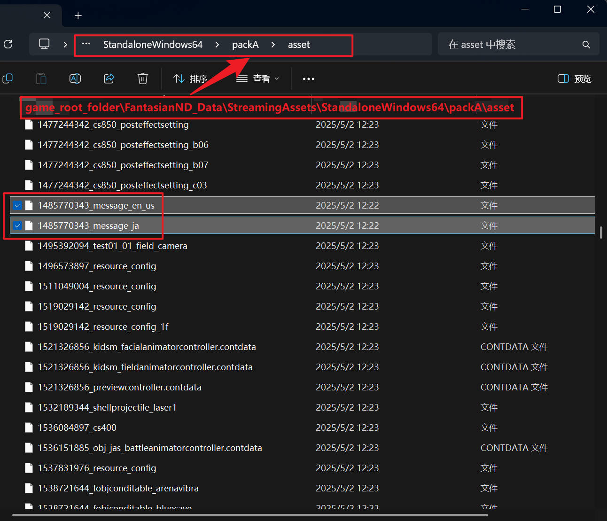

> **Game font file directories**
> 
> `"Game root directory \FantasianND_Data\StreamingAssets\StandaloneWindows64\packA\otf"`  
> 
> `"Game root directory \FantasianND_Data\StreamingAssets\StandaloneWindows64\packA\ttf"`  

Reference images:

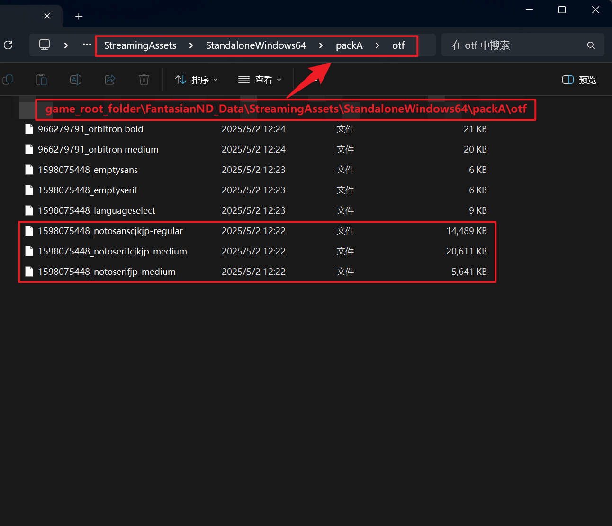
  

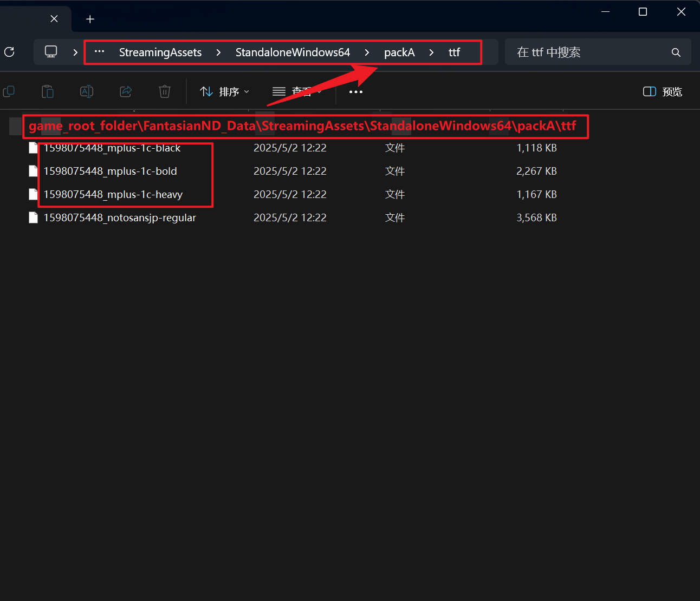

**Files:**

> **Language files**  
> There are two files—choose one; each corresponds to one of the game's language options:
> - `1485770343_message_ja`
>   - ↑ Contains Japanese text; best suited for replacing with non-Latin scripts
> - `1485770343_message_en_us`
>   - ↑ Contains English text; best suited for Latin script replacements
> ---
> **Font files**
> - **otf** folder:
>   - `1598075448_notosanscjkjp-regular`  
>     - Usage currently unknown (presumed for dialogue font), not included in this project—listed for reference only  
>   - `1598075448_notoserifcjkjp-medium`  
>     - Controls "Scene names at bottom right"  
>   - `1598075448_notoserifjp-medium`  
>     - Controls "Memories"

> - **ttf** folder:
>   - `1598075448_mplus-1c-black`  
>     - Controls "Top left of menu", "In-game time"  
>   - `1598075448_mplus-1c-bold`  
>     - Controls "Main menu options", "UI titles", "Top left main menu descriptions", "Character names in outer menus"  
>   - `1598075448_mplus-1c-heavy`  
>     - Controls "Menu text", "UI options (excluding main menu)", "Character names in inner menus"

Once verified, proceed to the next step.

---

# 2. Export the Text

**\*This guide uses Simplified Chinese localization as the primary demonstration. For non `Japanese → Simplified Chinese` localization, adjust the steps accordingly.**

Open UABEAvalonia; the following interface will appear. Load the `1485770343_message_ja` file as shown (you can also drag and drop it into the UABEAvalonia window).

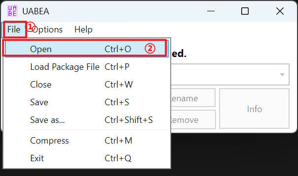

If the file is compressed (which it usually is), you'll see the prompt below. Choose `memory` (we don’t need to extract the entire file).

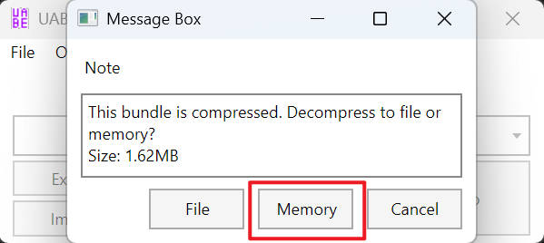

Click the `info` button shown below:

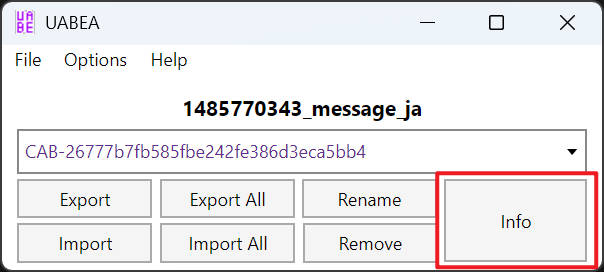

In the resulting window, select `message_ja` as shown, then click `Export Dump`:

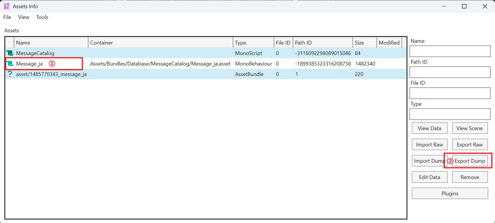

In the dialog that appears, choose `UABEA json dump (*.json)` as the file type, then save it using any name in your working directory.

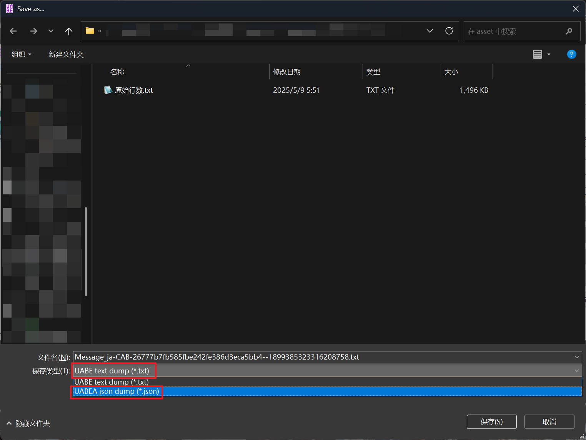

It’s recommended to save as `original.json`, and this guide uses that filename throughout the process.

After exporting `original.json`, the text extraction step is complete.

Proceed to the next step.

---

# 3. Convert Text Format to a General Format

After exporting `original.json`, run `json_csv_converter.exe` (available on the [release page](https://github.com/Kanadeforever/FantasianND_TrWorkflow/releases/tag/tools)).

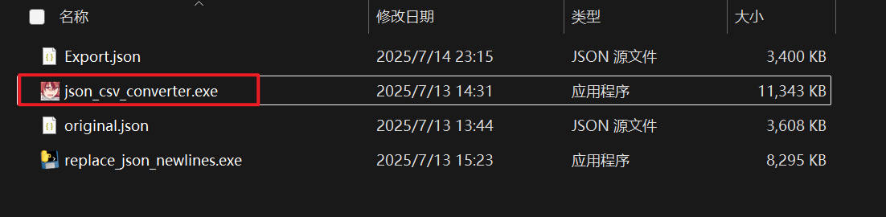

The default interface language is Simplified Chinese. If it opens in Chinese and you need English, click the topmost menu to switch languages.

The default mode is `json → csv`, which is correct. If the interface shows `csv → json`, click the button to switch modes:

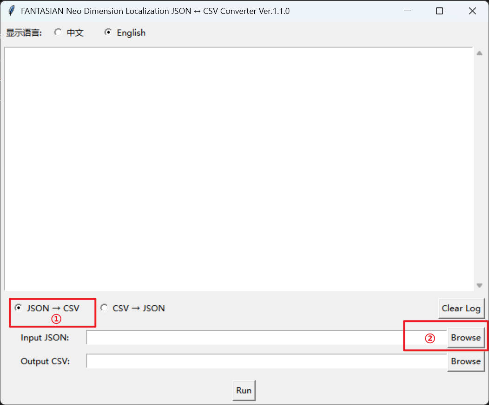

Once `json → csv` is selected, click the button next to the `Input JSON` field and choose `original.json`.

Click run. A CSV file named `original_text_output.csv` will be generated in the same directory.

Its structure looks like this:

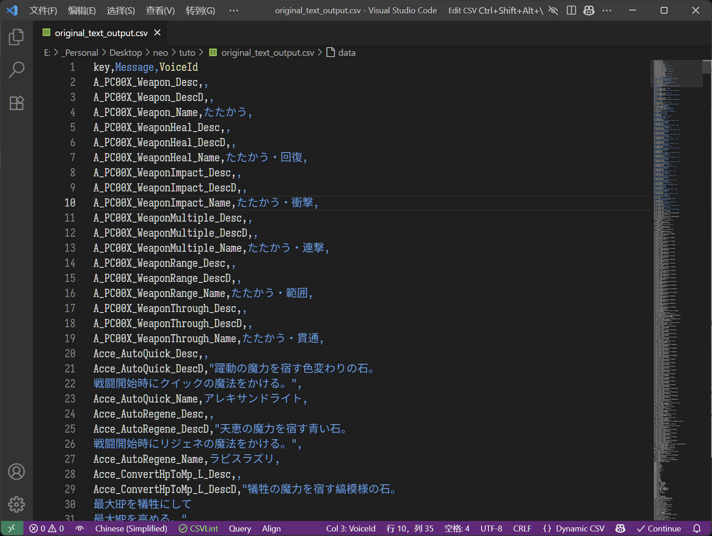

Preview in table format:

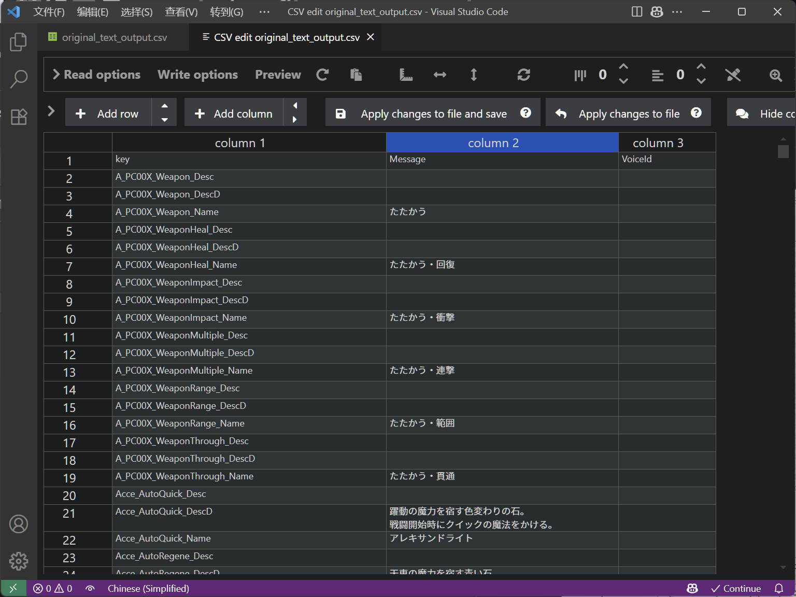

Now the translatable text has been converted to CSV format.

Proceed to the next step.

---

# 4. Translate the Text

Not much to explain here.

You may translate using an editor, import to localization software, free translation platforms, or paid translation platforms.

For Simplified Chinese localization, I used [ParaTranz](https://paratranz.cn/projects) to host the project. Below is a quick introduction for importing files there; for other platforms, please explore on your own.

Project link: https://paratranz.cn/projects/14499

**Notes on using the ParaTranz platform:**

> **If you want to use ParaTranz for translation, there are some things you need to pay attention to:**
>
> **Before importing into ParaTranz, some preprocessing is required:**
>
> This is the **CSV structure required by ParaTranz** (headers must be removed before import; ParaTranz does **not accept headers**):
>
> | Key | Source | Translation | Context (optional) |
> | :----: | :----: | :----: | :----: |
> | key_apple | apple | 苹果 | "A common, round fruit produced by the tree Malus domestica, cultivated in temperate climates."
> | key_pear | pear | 梨 |
> | key_peach | peach | 桃子 |
> | key_peach_etymology | "The scientific name persica, along with the word ""peach"" itself and its cognates in many European languages, derives from an early European belief that peaches were native to Persia (modern-day Iran)." |
> | key_potato | potato | 马铃薯 |
> | key_peas | peas | 豌豆 |
> | key_green_bean | green bean | 青豆 |
>
> This is a segment of the **exported translation-ready CSV** from earlier (also requires removal of header when importing):
>
> | Key | Message | VoiceId |
> | :-: | :-: | :-: |
> | A_PC00X_Weapon_Name | たたかう |
> | A_PC00X_WeaponHeal_Name | たたかう・回復 |
> | A_PC00X_WeaponImpact_Name | たたかう・衝撃 |
> | A_PC00X_WeaponMultiple_Name | たたかう・連撃 |
> | A_PC00X_WeaponRange_Name | たたかう・範囲 |
> | A_PC00X_WeaponThrough_Name | たたかう・貫通 |
> | Acce_AutoQuick_DescD | "躍動の魔力を宿す色変わりの石。\n戦闘開始時にクイックの魔法をかける。" |
> | Acce_AutoQuick_Name | アレキサンドライト |
> | Acce_AutoRegene_DescD | "天恵の魔力を宿す青い石。\n戦闘開始時にリジェネの魔法をかける。" |
> | Acce_AutoRegene_Name | ラピスラズリ |
> | Acce_ConvertHpToMp_L_DescD | "犠牲の魔力を宿す縞模様の石。\n最大HPを犠牲にして\n最大MPを高める。" |
> | Acce_ConvertHpToMp_L_Name | ダイメノウ |
> | Acce_ConvertHpToMp_S_DescD | "犠牲の魔力を宿す縞模様の石。\n最大HPを犠牲にして\n最大MPを高める。" |
>
> Referencing these two tables, the preprocessed file required for import only needs to **remove the header**, with no need to manually add a context column.
>
> ---
>
> When downloading the translated CSV file from ParaTranz, the file will **include a column for the original text**, which means it cannot be directly converted back to JSON using `json_csv_converter.exe`.
>
> To fix this, use the [process_csv.py](../transfile_converter_src/process_csv.py) script in this project.  
> Usage: `python process_csv.py your_csv_file`  
> Once complete, a new file will be generated with the original headers and without the source text column. Its name will match your original file but with `_done` appended.
>
> After processing, the resulting file is ready for the next step.

---

# 5. Convert Translated Text Back to Game Format

Before importing, check the file:

Text files to be imported cannot detect manual line breaks in editors—use `\n` as a line break marker. Example:

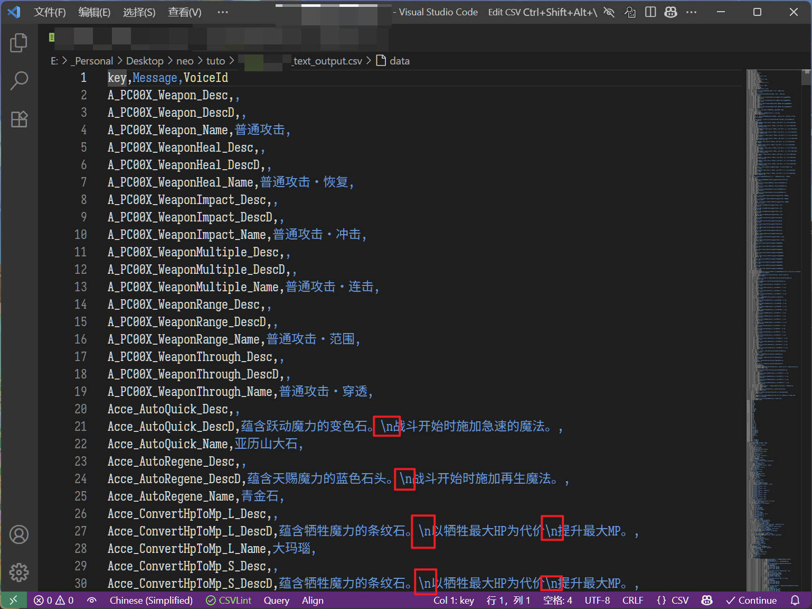
  

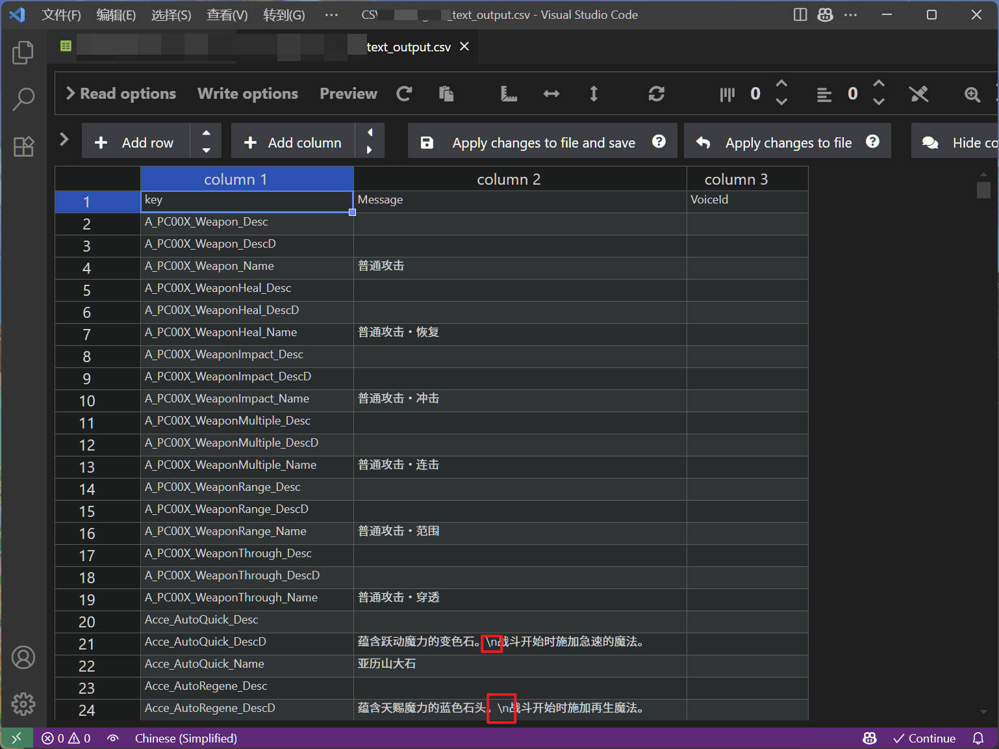

After verifying line breaks, check file encoding. The game only accepts `UTF-8` encoding (**without BOM**) and `CRLF` line endings. If incorrect, use VSCode to convert as shown below:

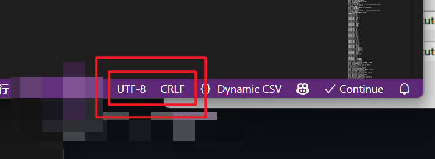

After modifying, save the file—you're good to go.

Run `json_csv_converter.exe` again, this time choose `csv → json`.

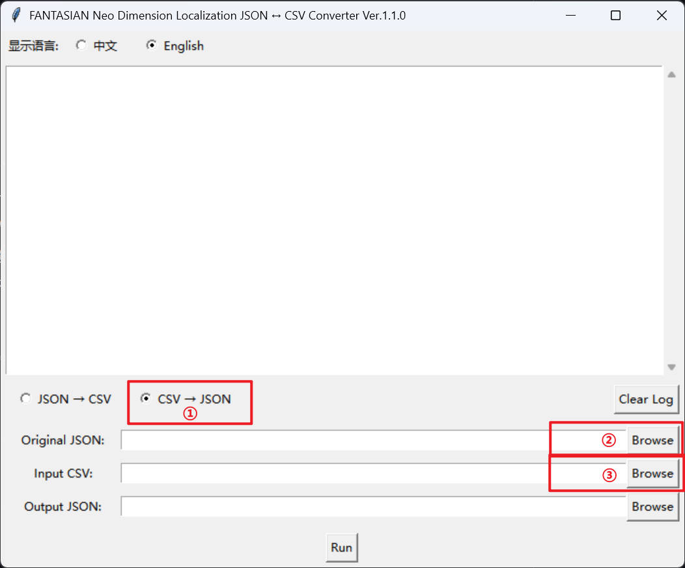

Enter the original exported `original.json` and the processed translation CSV as shown.

Then click Run.

If the CSV is correctly encoded, the tool will directly output the final JSON file. Otherwise, it will throw an error.

If an error occurs, debug it based on the message provided.

After generating the translated JSON, proceed to the next step.

---

# 6. Fix Escaped Line Breaks

The exported JSON will have line breaks escaped, so one final step is needed (modifying the tool would be more complicated).

Here’s how the issue looks:

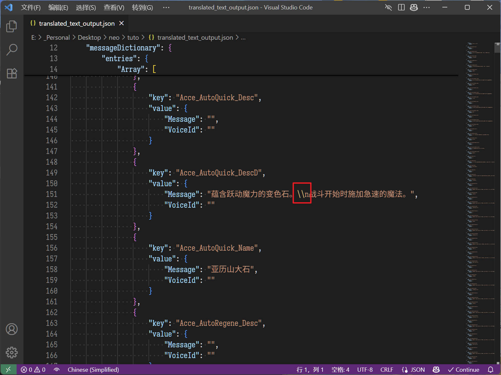

Drag your JSON file onto `replace_json_newlines.exe` ([download here](https://github.com/Kanadeforever/FantasianND_TrWorkflow/releases/tag/tools)).

The newly generated file will have corrected line breaks, as shown in the comparison below:

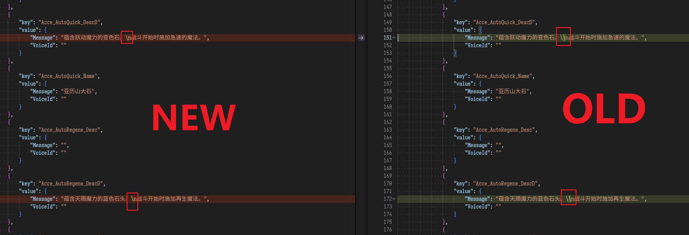

Alternatively, you can batch replace `\\n` with `\n` using a text editor.

Up to you.

Once this step is done, continue.

---

# 7. Import Translated Text

Open UABEAvalonia and load the source file containing text, following the same steps as in the export section (remember to back up). Then click the `info` button:

In the pop-up window, select `message_ja`, then click `Import Dump`.

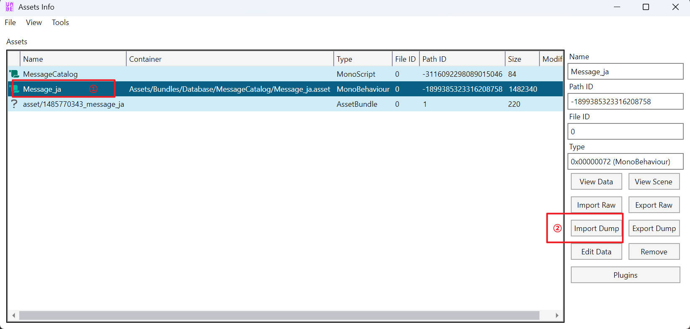

Choose your final processed `*.json` file. If it’s not visible, select JSON in the bottom-right file type filter.

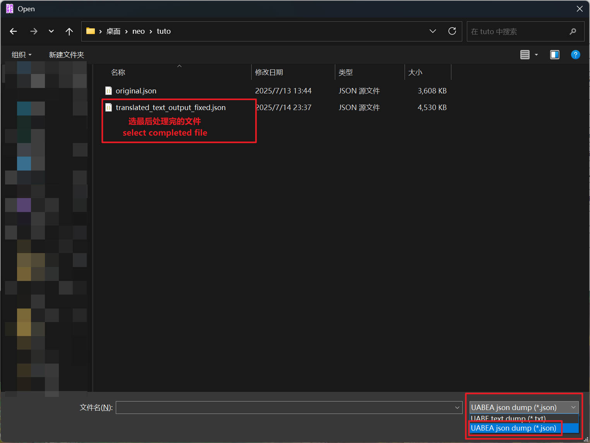

Press `Ctrl+S` or save via the interface as shown below:

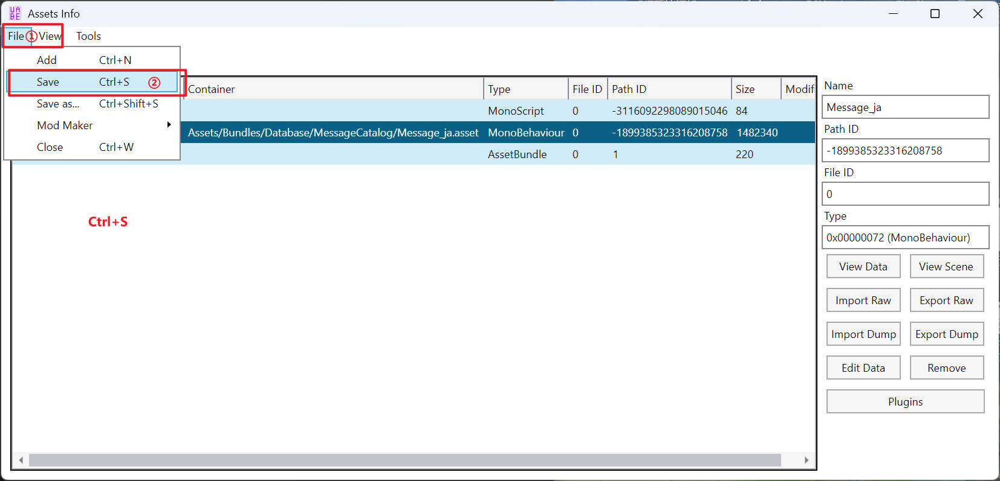

You’ll see a file saved confirmation:

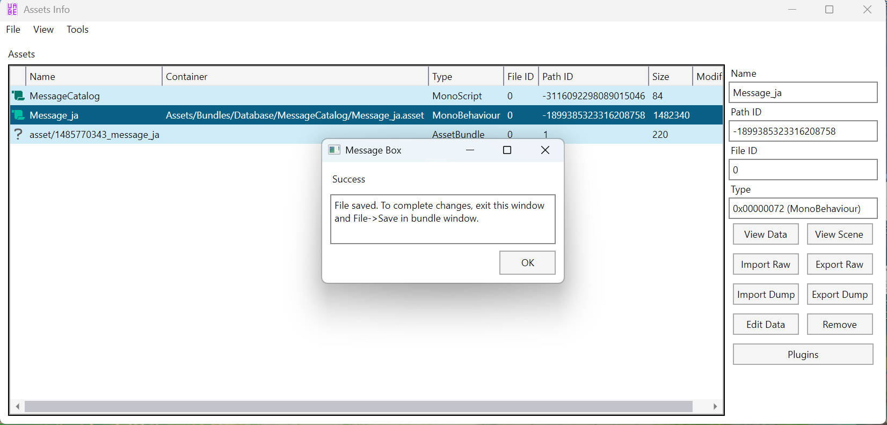

Close the dialog and return to UABEA’s main interface, then save the file again via `Ctrl+S` or the menu:

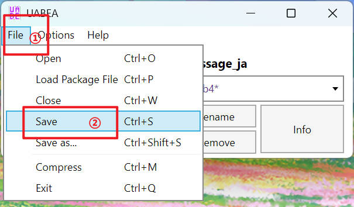

Your file has now been successfully imported.

If you don’t need to modify fonts, you can proceed to assembly.

Otherwise, move on to the next step.

---

## 7.1 (Optional) Compress the Imported File

If the imported text file is around `1.5MB`, compression may not be necessary. If you want to compress it:

Select the compression option as shown below, or press `Ctrl+M`:

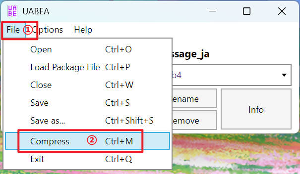

A prompt will ask for the save name—**this name must exactly match the original game text filename.**

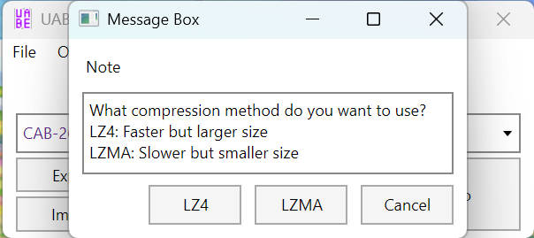

After saving, compression parameters will appear. The game defaults to LZ4 compression—resulting file size will be around `500KB+`.  
If using LZMA, file size will be `330KB+`.

Tests show that compression type does not affect game loading speed.

---

# 8. (Optional) Replace Fonts

Use UABEA to load font files (same method as text import/export).

Click `info`, and in the pop-up window select entries where `Type` is `Font`. Then click the lowest plugin button on the right.

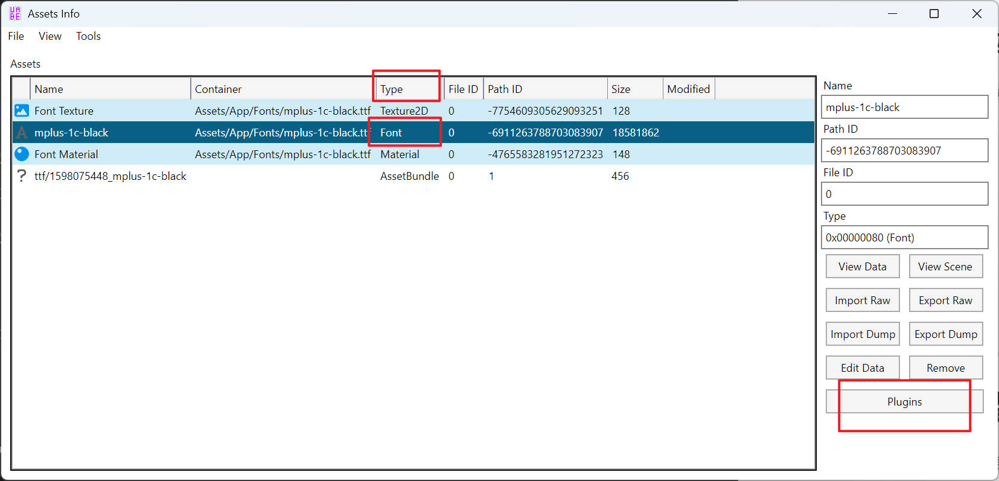

Click `import` and select your font file:

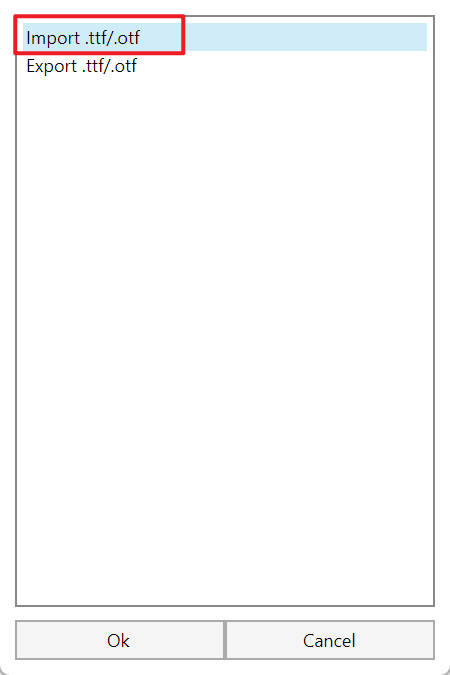

Press `Ctrl+S` to save, close the window, return to UABEA’s main interface, and save again via `Ctrl+S`.

Font files tend to be large, so it’s recommended to compress them with LZMA (same process as above).

Once complete, continue to the next step.

---

# 9. Assemble Localization Files

Download the x64 version of [Ultimate ASI Loader](https://github.com/ThirteenAG/Ultimate-ASI-Loader).  
Rename the downloaded DLL to `version.dll` or `winmm.dll` (**version.dll** is recommended).

Place the DLL in the game’s root directory—same location as `FantasianND.exe`.  
Create a new `update` folder in this directory.

Place your modified files in the `update` folder following the same directory structure as the game:

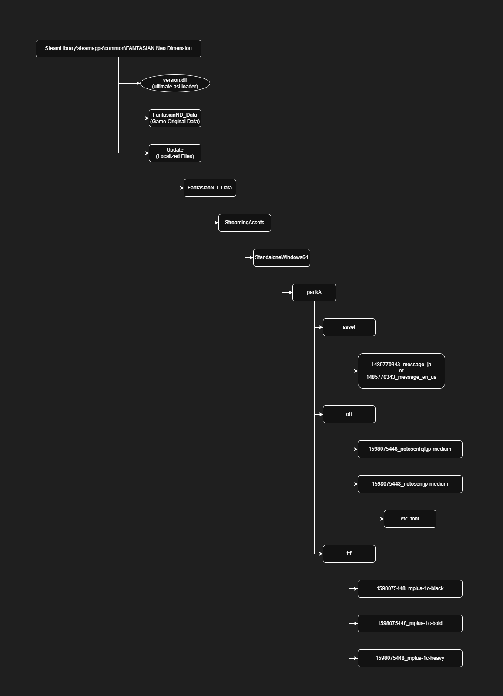

---

# 10. Testing

Now you can launch the game and test.

This method physically separates your files from the game’s original files—custom operations won’t interfere with official updates and make debugging easier.

Once everything is confirmed working, package the `update` folder along with `version.dll` or `winmm.dll` (whichever you chose), and you’re ready to distribute.
